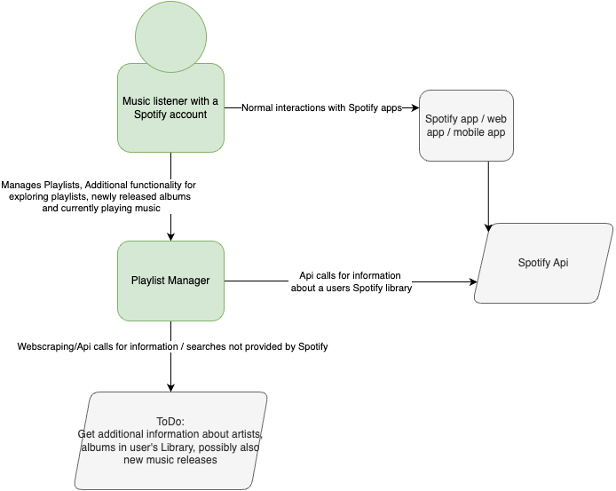
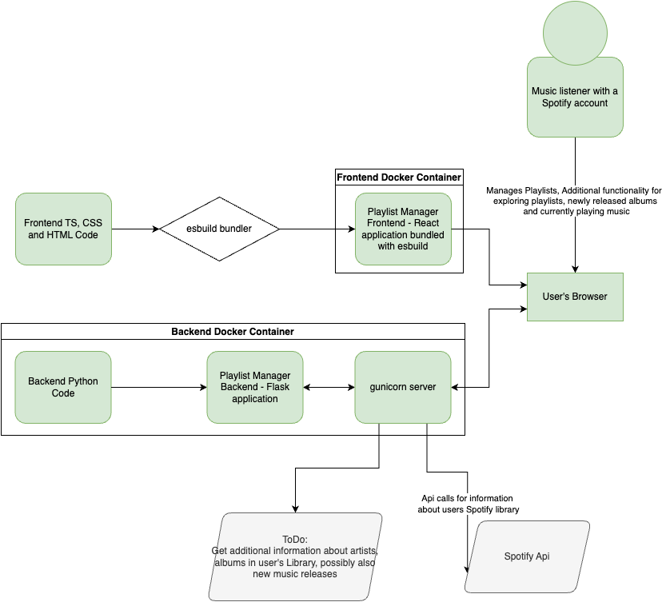
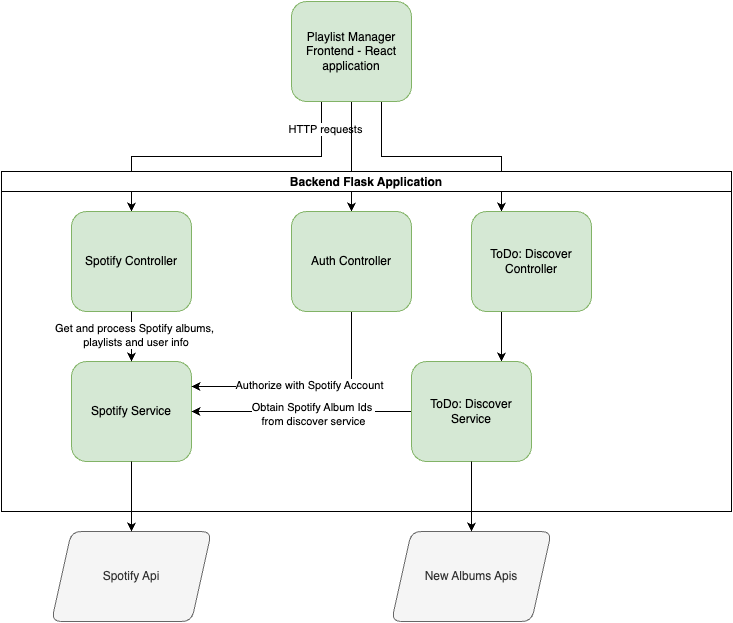

# playlist-manager

## Basic set up

Requirements:

-   Python
-   Poetry
-   Node & npm

`bash install.sh`

Set up an app registered at <https://developer.spotify.com/dashboard>

Set a Redirect URL for `http://localhost:8080`.

Create a `.env` file in the `backend` folder based on `.env.template`, and set the appropriate missing variables using those from the Spotify dashboard.

## Running it

Run the [backend](./backend/README.md) by first navigating to the backend folder with `cd backend` then running `poetry run flask run`

Run the [frontend](./frontend/README.md) by first navigating to the frontend folder with `cd frontend` then running `npm run dev`

> Note: You will need to install the requirements in each first.

## Running in Docker

Install [Docker](https://www.docker.com/products/docker-desktop/) (Windows installation instructions can be found [here](https://docs.docker.com/desktop/install/windows-install/)).

From the project root run `docker compose up`

From the frontend directory, build the frontend in development mode with `docker build --target development --tag frontend:dev .`

From the backend directory, build the backend in development mode with `docker build --target development --tag backend:dev .`

Build backend tests docker image with `docker build --target test --tag backend:test ./backend/`

Run backend in development mode from the backend folder with `docker run --env-file .env -p 5000:5000 --mount "type=bind,source=$(pwd)/src,target=/backend/src" backend:dev`

Run frontend in development mode from the frontend folderwith `docker run -it --init --env-file .env -p 8080:8080 --mount "type=bind,source=$(pwd)/src,target=/frontend/src" frontend:dev` (use --entrypoint /bin/bash for debugging)

## Provisioning VMs with Ansible

VMs can be prepared and configured with Ansible from the `/ansible` directory. To set up managed nodes, set the IP addresses in `ansible-inventory`. Your control node will need to have SSH access to these nodes (this can be done from a mac, or another VM with the repo installed).

You will also need .env.j2 files set up in both the frontend and backend to correctly match the .env.template file. Any variables referenced in .env.j2 files must be defined in an `.ansible-secrets.yml` file next to `.ansible-secrets.template.yml`.

To provision the VMs run `ansible-playbook ansible-playbook.yml -i ansible-inventory` in the `ansible` directory. This will start up the Playlist Manager on the VMs. To stop the application. You can also run `ansible-playbook stop-playlist-manager-playbook.yml -i ansible-inventory`.

## Application Diagrams

### Context

_The application uses the Spotify Api to obtain information on a users playlists and active playback. It presents this information to the user in a way that enhances the functionality of Spotify's mobile and web apps._

### Containers

_The application is comprised of a React frontend bundled with esbuild, and a python backend, built using Flask. Each of these is hosted in separate Docker containers. The backend application sits behind a guinicorn server._

### Components

  
Currently the backend consists of an auth endpoints and endpoints for communicating with the Spotify API.\_

## CI

Pipelines will run when pull requests are created or commits are pushed to the origin.

## Deployment

The frontend and backend applications are deployed to two Azure Web Applications. The frontend can be accessed [here](https://playman.azurewebsites.net/) These can be updated locally by:

1. Building new Docker images with (from the relevant frontend/backend directory) `docker build --target production --tag calpin/playlist-manager-"frontend/backend":prod .`
2. Pushing the new image to Docker Hub `docker push calpin/playlist-manager-"frontend/backend":prod`
3. Sending a curl request to the appropriate Webhook url:
    - Frontend: `curl -dH -X POST "Frontend Webhook from Azure"`
    - Backend: `curl -dH -X POST "Backend Webhook from Azure"`

## Database Migrations

Database migrations can be run with the following steps:
1. Navigate to the /backend folder.
3. Run Python locally (e.g. `python3`). 
4. From the Python terminal import the migration functions you wish to run. (e.g. `from src.database.migrations.m_241030_add_access_tokens_table import up, down`).
5. Running the desired migration (e.g. `up()`).